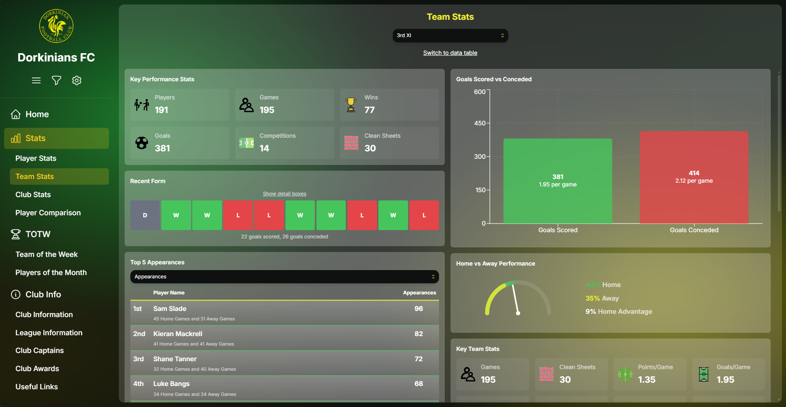
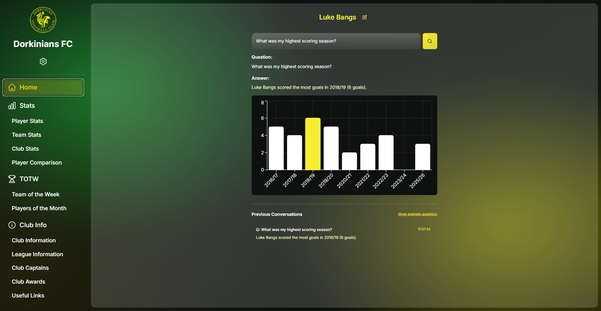
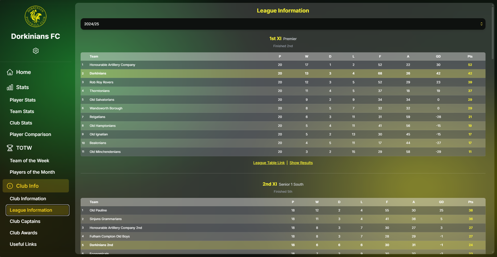

<p align="center">
  
</p>

<h1 align="center">Dorkinians FC Statistics Website</h1>

<p align="center">
  <strong>Mobile-first PWA chatbot statistics website</strong> for Dorkinians FC with natural language processing, graph database architecture, and advanced data visualization
</p>

<p align="center">
  <a href="https://dorkinians-website-v3.netlify.app">🌐 Live Demo</a> •
  <a href="#key-features">✨ Features</a> •
  <a href="#tech-stack">🛠️ Tech Stack</a> •
  <a href="#architecture">🏗️ Architecture</a> •
  <a href="https://bangsluke-documentation.netlify.app/docs/projects/dorkinians-website">📚 User Documentation</a>
</p>

<p align="center">
  <a href="https://app.netlify.com/projects/dorkinians-website-v3/deploys">
    
  </a>
  
  
  
  
  
</p>

<p align="center">
  
</p>

## Table of Contents

- [Table of Contents](#table-of-contents)
- [Project Overview](#project-overview)
  - [Live Demo](#live-demo)
  - [Key Features](#key-features)
  - [Tech Stack](#tech-stack)
  - [Screenshots](#screenshots)
    - [Home Page](#home-page)
    - [Team Stats](#team-stats)
    - [League Information](#league-information)
- [Architecture](#architecture)
  - [Chatbot Architecture](#chatbot-architecture)
    - [Natural Language Processing \& Entity Extraction](#natural-language-processing--entity-extraction)
- [Query Processing Pipeline](#query-processing-pipeline)
  - [Stage 1: Text Preprocessing](#stage-1-text-preprocessing)
  - [Stage 2: Entity Recognition](#stage-2-entity-recognition)
  - [Stage 3: Fuzzy Resolution](#stage-3-fuzzy-resolution)
  - [Stage 4: Question Analysis](#stage-4-question-analysis)
  - [Stage 5: Database Query Execution](#stage-5-database-query-execution)
  - [Stage 6: Natural Language Response Generation](#stage-6-natural-language-response-generation)
  - [Stage 7: Response Assembly](#stage-7-response-assembly)
- [Key File Functionalities](#key-file-functionalities)
  - [Core Processing Files](#core-processing-files)
  - [Query Processing Flow](#query-processing-flow)
  - [Response Generation](#response-generation)
- [Quick Start](#quick-start)
  - [Development Start](#development-start)
  - [Production Start](#production-start)
  - [Database Seeding](#database-seeding)
  - [Database Verification](#database-verification)
- [Configuration](#configuration)
  - [Environment Variables](#environment-variables)
  - [Schema Management](#schema-management)
- [API Endpoints](#api-endpoints)
  - [Chatbot Query Endpoint](#chatbot-query-endpoint)
  - [Database Seeding Endpoint](#database-seeding-endpoint)
- [Additional Documentation](#additional-documentation)

## Project Overview

**Mobile-first PWA chatbot statistics website** for Dorkinians FC that processes natural language queries and returns visualized data using reusable chart components.

This project demonstrates modern full-stack development practices, combining advanced NLP techniques, graph database architecture, and progressive web app technologies to create an intuitive, performant user experience.

### Live Demo

🌐 **Production Site**: [https://dorkinians-website-v3.netlify.app](https://dorkinians-website-v3.netlify.app)

> [Back to Table of Contents](#table-of-contents)

### Key Features

- **Mobile-First Design**: Optimized for mobile devices with native app feel
- **PWA Interface**: Progressive Web App with chatbot as primary interface
- **Natural Language Processing**: Process user questions and return visualized answers
- **Unified Data Schema**: Single source of truth for all data definitions
- **Database**: Neo4j Aura for efficient data storage and querying
- **Comprehensive Statistics**: Detailed player, team, and club statistics with multiple visualization types
- **Player Comparison**: Side-by-side player comparison with interactive radar charts
- **Team of the Week**: Weekly best XI display with visual pitch formation and player details
- **Players of the Month**: Monthly award winners and historical achievements
- **Advanced Filtering**: Filter statistics by time range, team, location, opposition, competition, result, and position
- **Club Information**: Club history, milestones, league information, captains, and awards
- **Settings Hub**: Quick navigation to all sections, database status monitoring, and PWA installation
- **Swipe Navigation**: Intuitive swipe gestures for navigating between pages on mobile devices
- **Player Context**: Set player context for personalized chatbot queries using pronouns

> [Back to Table of Contents](#table-of-contents)

### Tech Stack

**Frontend:**
- **Next.js 14** - React framework with App Router, Server Components, and optimized performance
- **TypeScript** - Strict type safety throughout the codebase
- **Tailwind CSS** - Utility-first CSS framework
- **Zustand** - Lightweight state management
- **Framer Motion** - Smooth animations and transitions
- **Recharts** - Data visualization library

**Backend & Database:**
- **Google Sheets** - Data source for the chatbot and statistics
- **Neo4j Aura** - Graph database for relationship-based queries
- **Cypher** - Graph query language for complex statistical queries
- **Next.js API Routes** - Serverless API endpoints

**Natural Language Processing:**
- **compromise** - Advanced text parsing and linguistic analysis
- **natural** - Fuzzy string matching algorithms (Jaro-Winkler, Levenshtein, Dice)

**Testing & Quality:**
- **TypeScript** - Compile-time type checking
- **Jest** - Unit and integration testing
- **Playwright** - End-to-end browser testing

**Deployment & DevOps:**
- **Netlify** - Hosting and edge functions
- **GitHub Actions** - CI/CD pipeline
- **PWA** - Progressive Web App with service workers

> [Back to Table of Contents](#table-of-contents)

### Screenshots

#### Home Page

<p align="center">
  
</p>

#### Team Stats

<p align="center">
  
</p>

#### League Information

<p align="center">
  
</p>

> [Back to Table of Contents](#table-of-contents)

## Architecture

The application follows a modern, scalable architecture:

```
┌─────────────────────────────────────────────────────────────┐
│                      Frontend (Next.js 14)                  │
│  ┌──────────────┐  ┌──────────────┐  ┌──────────────┐       │
│  │   PWA UI     │  │  Chatbot     │  │  Stats       │       │
│  │  Components  │  │  Interface   │  │  Visualizer  │       │
│  └──────────────┘  └──────────────┘  └──────────────┘       │
└───────────────────────┬─────────────────────────────────────┘
                        │
                        ▼
┌─────────────────────────────────────────────────────────────┐
│                  API Layer (Next.js Routes)                 │
│  ┌──────────────────────────────────────────────────────┐   │
│  │  /api/chatbot - NLP Processing & Query Generation    │   │
│  └──────────────────────────────────────────────────────┘   │
└───────────────────────┬─────────────────────────────────────┘
                        │
                        ▼
┌─────────────────────────────────────────────────────────────┐
│              NLP Pipeline (Entity Extraction)               │
│  ┌──────────┐  ┌──────────┐  ┌──────────┐  ┌──────────┐     │
│  │  Text    │→ │ Entity   │→ │  Fuzzy   │→ │ Question │     │
│  │  Preproc │  │ Extract  │  │ Matching │  │ Analysis │     │
│  └──────────┘  └──────────┘  └──────────┘  └──────────┘     │
└───────────────────────┬─────────────────────────────────────┘
                        │
                        ▼
┌─────────────────────────────────────────────────────────────┐
│              Database Layer (Neo4j Aura)                    │
│  ┌──────────────────────────────────────────────────────┐   │
│  │  Graph Database with Cypher Query Execution          │   │
│  │  - Players, Teams, Matches, Statistics               │   │
│  │  - Relationship-based queries                        │   │
│  └──────────────────────────────────────────────────────┘   │
└─────────────────────────────────────────────────────────────┘
```

> [Back to Table of Contents](#table-of-contents)

### Chatbot Architecture

The chatbot is the core functionality of the application, processing natural language queries about Dorkinians FC statistics and returning visualized responses.

#### Natural Language Processing & Entity Extraction

The chatbot uses a sophisticated entity extraction pipeline for sports terminology:

**Core Libraries** ([`lib/services/chatbotService.ts`](./lib/services/chatbotService.ts)):

- **`natural`**: Fuzzy string matching for all entity types (players, teams, oppositions, leagues)
- **`compromise`**: Advanced text parsing and linguistic analysis for better entity extraction
- **Custom Entity Extraction**: [`lib/config/entityExtraction.ts`](./lib/config/entityExtraction.ts) for domain-specific sports terminology
- **Entity Name Resolution**: [`lib/services/entityNameResolver.ts`](./lib/services/entityNameResolver.ts) for intelligent fuzzy matching of all entity types

**7-Class Entity Recognition** ([`EntityExtractor` class](./lib/config/entityExtraction.ts)):

- **Players**: Up to 3 per question with fuzzy matching, typo tolerance, and pseudonym support
- **Teams**: 1st, 2nd, 3rd etc. team recognition with ordinal number parsing
- **Stat Types**: Goals, appearances, TOTW, penalties, etc. with 50+ pseudonyms
- **Stat Indicators**: Highest, lowest, average, longest, shortest, consecutive
- **Question Types**: How many, where, who, what, which, when
- **Negative Clauses**: Excluding, without, not (for filtered queries)
- **Locations**: Home, away, specific grounds (up to 2 per question)
- **Time Frames**: Seasons, dates, gameweeks, streaks, temporal expressions

**Advanced Entity Name Resolution**:

- **Comprehensive Fuzzy Matching**: Handles typos for players, teams, oppositions, and leagues
  - Players: "Luk Bangs" → "Luke Bangs"
- **Multiple Algorithms**: Jaro-Winkler, Levenshtein, and Dice coefficient
- **Confidence Scoring**: Only suggests matches above 60% confidence
- **Dynamic Database**: Queries all entities from database for comprehensive matching
- **Smart Suggestions**: Provides alternative entity names for near-misses
- **Type-Specific Resolution**: Each entity type uses optimized matching strategies

## Query Processing Pipeline

The chatbot processes user questions through a sophisticated multi-stage pipeline:

### Stage 1: Text Preprocessing

**File**: [`lib/config/entityExtraction.ts`](./lib/config/entityExtraction.ts) (EntityExtractor constructor)

- **Question Normalization**: Converts to lowercase, removes special characters, normalizes whitespace
- **Context Extraction**: Analyzes user context and previous conversation state
- **Linguistic Analysis**: Uses `compromise` library for advanced text parsing and part-of-speech tagging

**Example**: `"How many goals has Luk Bangs got for the 3s whilst playing at home between 20/03/2022 and 21/10/24?"`

- **Normalized**: `"how many goals has luk bangs got for the 3s whilst playing at home between 20/03/2022 and 21/10/24"`
- **NLP Analysis**: Identifies "Luk Bangs" as proper noun, "goals" as noun, "3s" as number+noun, "home" as location, dates as temporal expressions

### Stage 2: Entity Recognition

**File**: [`lib/config/entityExtraction.ts`](./lib/config/entityExtraction.ts) (extractEntities method)

- **Multi-Pass Extraction**: Uses regex patterns and NLP techniques to identify entities
- **7-Class Recognition**: Players, teams, stat types, indicators, question types, negative clauses, locations, time frames
- **Pseudonym Support**: Handles 50+ alternative names for stats and entities
- **Context-Aware**: Considers surrounding words and phrases for better accuracy

**Example**: `"How many goals has Luk Bangs got for the 3s whilst playing at home between 20/03/2022 and 21/10/24?"`

- **Player**: "Luk Bangs" (proper noun detection)
- **Stat Type**: "goals" (matches stat pseudonyms)
- **Team**: "3s" (regex pattern `/\b(1s|2s|3s|4s|5s|6s|7s|8s)/`)
- **Location**: "home" (location entity detection)
- **Time Frame**: "between 20/03/2022 and 21/10/24" (date range detection)
- **Question Type**: "how many" (interrogative detection)

### Stage 3: Fuzzy Resolution

**File**: [`lib/config/entityExtraction.ts`](./lib/config/entityExtraction.ts) (resolveEntitiesWithFuzzyMatching method)

- **Intelligent Matching**: Resolves all entities using multiple fuzzy matching algorithms
- **Confidence Scoring**: Only suggests matches above 60% confidence threshold
- **Type-Specific Logic**: Different strategies for players, teams, oppositions, and leagues
- **Database Integration**: Queries live database for comprehensive entity matching

**Example**: `"How many goals has Luk Bangs got for the 3s whilst playing at home between 20/03/2022 and 21/10/24?"`

- **Player Resolution**: "Luk Bangs" → "Luke Bangs" (fuzzy match, confidence: 0.92)
- **Team Resolution**: "3s" → "3rd XI" (fuzzy match, confidence: 0.85)
- **Location Resolution**: "home" → "home" (exact match, confidence: 1.0)
- **Stat Resolution**: "goals" → "goals" (exact match, confidence: 1.0)
- **Time Frame Resolution**: "between 20/03/2022 and 21/10/24" → "2022-03-20 to 2024-10-21" (date parsing)

### Stage 4: Question Analysis

**File**: [`lib/config/enhancedQuestionAnalysis.ts`](./lib/config/enhancedQuestionAnalysis.ts) (analyze method)

- **Complexity Assessment**: Categorizes questions as simple, moderate, or complex
- **Clarification Detection**: Identifies ambiguous queries requiring user input
- **Intent Classification**: Determines question type and required response format

**Example**: `"How many goals has Luk Bangs got for the 3s whilst playing at home between 20/03/2022 and 21/10/24?"`

- **Question Type**: "player" (specific player query)
- **Complexity**: "complex" (multiple entities: player + team + location + stat + time frame)
- **Team Context**: Detected team entity "3rd XI"
- **Location Context**: Detected location "home"
- **Time Context**: Detected date range "2022-03-20 to 2024-10-21"
- **Requires Clarification**: No (all entities resolved)

### Stage 5: Database Query Execution

**File**: [`lib/services/chatbotService.ts`](./lib/services/chatbotService.ts) (queryRelevantData method)

- **Query Construction**: Builds optimized Cypher queries based on analysis
- **Performance Optimization**: Uses caching and query optimization techniques
- **Error Handling**: Graceful fallbacks for database connectivity issues
- **Result Processing**: Formats and structures data for presentation

**Example**: `"How many goals has Luk Bangs got for the 3s whilst playing at home between 20/03/2022 and 21/10/24?"`

- **Query Type**: Player + Team + Location + Time Range query
- **Cypher Query**:
  ```cypher
  MATCH (p:Player {playerName: "Luke Bangs"})-[:PLAYED_IN]->(md:MatchDetail)
  WHERE md.team = "3rd XI"
    AND md.location = "home"
    AND md.matchDate >= date("2022-03-20")
    AND md.matchDate <= date("2024-10-21")
  RETURN p.playerName, coalesce(sum(md.goals), 0) as value
  ```
- **Database Result**: `[{ playerName: "Luke Bangs", value: 4 }]`

### Stage 6: Natural Language Response Generation

**File**: [`lib/config/naturalLanguageResponses.ts`](./lib/config/naturalLanguageResponses.ts) (imported functions)

- **Template Selection**: Chooses appropriate response templates based on question type
- **Verb Conjugation**: Automatically selects correct verb forms (has/have, is/are, etc.)
- **Contextual Formatting**: Adapts language based on data type and user context
- **Personalization**: Uses appropriate pronouns and references based on user selection

**Example**: `"How many goals has Luk Bangs got for the 3s whilst playing at home between 20/03/2022 and 21/10/24?"`

- **Template**: Player-specific response with team, location, and time context
- **Verb Selection**: "has" (singular player)
- **Number Formatting**: "4" (integer)
- **Context Integration**: Includes team ("3rd XI"), location ("at home"), and time range ("between March 2022 and October 2024")
- **Generated Text**: "Luke Bangs has scored 4 goals for the 3rd XI at home between March 2022 and October 2024."

### Stage 7: Response Assembly

**File**: [`lib/services/chatbotService.ts`](./lib/services/chatbotService.ts) (generateResponse method)

- **Data Integration**: Combines database results with natural language templates
- **Visualization Selection**: Chooses appropriate chart/table types based on data
- **Source Attribution**: Tracks and reports data sources for transparency
- **Quality Validation**: Ensures response accuracy and completeness

**Example**: `"How many goals has Luk Bangs got for the 3s whilst playing at home between 20/03/2022 and 21/10/24?"`

- **Final Answer**: "Luke Bangs has scored 4 goals for the 3rd XI at home between March 2022 and October 2024."
- **Visualization**: NumberCard (single value display)
- **Data**: `{ playerName: "Luke Bangs", value: 4, team: "3rd XI", location: "home", timeRange: "2022-03-20 to 2024-10-21" }`
- **Sources**: ["Neo4j Database"]
- **Cypher Query**: Logged for transparency

## Key File Functionalities

### Core Processing Files

**`lib/config/entityExtraction.ts`** - Entity Recognition Engine

- **Purpose**: Identifies and extracts all relevant entities from user questions
- **Key Features**:
  - 7-class entity recognition (players, teams, stats, indicators, etc.)
  - NLP-powered player name extraction using `compromise`
  - Pseudonym support for 50+ alternative stat names
  - Context-aware extraction considering surrounding words
  - Fuzzy matching integration for all entity types

**`lib/services/entityNameResolver.ts`** - Intelligent Entity Resolution

- **Purpose**: Resolves entity names using fuzzy matching algorithms
- **Key Features**:
  - Multi-algorithm fuzzy matching (Jaro-Winkler, Levenshtein, Dice coefficient)
  - Type-specific resolution strategies for different entity types
  - Confidence scoring with 60% threshold for suggestions
  - Database integration for comprehensive entity matching
  - Caching system for performance optimization

**`lib/config/naturalLanguageResponses.ts`** - Response Generation Engine

- **Purpose**: Generates natural, contextually appropriate responses
- **Key Features**:
  - Template-based response generation
  - Automatic verb conjugation (has/have, is/are, etc.)
  - Contextual formatting based on data types
  - Personalization using user selection context
  - Dynamic language adaptation

**`lib/config/enhancedQuestionAnalysis.ts`** - Question Intelligence

- **Purpose**: Analyzes question complexity and determines processing requirements
- **Key Features**:
  - Complexity assessment (simple/moderate/complex)
  - Clarification detection for ambiguous queries
  - Intent classification and question type determination
  - Integration with fuzzy matching for entity resolution

**`lib/services/chatbotService.ts`** - Main Orchestration Engine

- **Purpose**: Coordinates the entire query processing pipeline
- **Key Features**:
  - Query analysis and routing
  - Database query construction and execution
  - Response assembly and formatting
  - Error handling and fallback mechanisms
  - Performance optimization and caching

**Fuzzy Matching Benefits**:

- **Typo Tolerance**: Users can misspell names and still get accurate results
- **Variation Handling**: Handles different ways of referring to the same entity
- **Confidence-Based**: Only suggests matches above 60% confidence to avoid false positives
- **Performance Optimized**: Caching system reduces database queries for repeated lookups
- **Comprehensive Coverage**: Works across all entity types in the system

**Advanced Features**:

- **Multi-Entity Support**: Complex comparisons (e.g., "How many goals have I, Kieran Mackrell and Ali Robins scored?")
- **Special Logic**: "Goal involvements" = goals + assists, comprehensive pseudonym recognition
- **Clarification Detection**: Identifies ambiguous queries requiring user clarification
- **Context Awareness**: Superior understanding of sports queries with player context switching

**Implementation**: [`EnhancedQuestionAnalyzer` class](./lib/config/enhancedQuestionAnalysis.ts) orchestrates the extraction process with seamless Next.js integration.

> [Back to Table of Contents](#table-of-contents)

### Query Processing Flow

The chatbot processes natural language queries through a sophisticated multi-stage pipeline:

1. **Input Reception** ([`ChatbotInterface`](./components/ChatbotInterface.tsx) passed player context to [`app/api/chatbot/route.ts`](./app/api/chatbot/route.ts))
   - User submits query via [`ChatbotInterface`](./components/ChatbotInterface.tsx) component and passes player context to the API endpoint ([`app/api/chatbot/route.ts`](./app/api/chatbot/route.ts))
   - API endpoint validates input and receives player context directly

2. **Enhanced Entity Extraction** ([`lib/config/enhancedQuestionAnalysis.ts`](./lib/config/enhancedQuestionAnalysis.ts))
   - [`EnhancedQuestionAnalyzer` class](./lib/config/enhancedQuestionAnalysis.ts) processes the question and uses `EntityExtractor` to identify 7 entity types: players, teams, stats, indicators, question types, locations, timeframes
   - It assesses the complexity of the question (based on how many entities and stat types are present) and determines if it requires clarification
   - It determines the question type (e.g. player, team, club, fixture, comparison) based on the extracted entities and content

3. **Question Analysis** ([`lib/services/chatbotService.ts`](./lib/services/chatbotService.ts))
   - `analyzeQuestion()` method determines query type and complexity
   - Classifies as: player, team, club, fixture, comparison, streak, double_game, temporal, or general
   - Validates question clarity and requests clarification if needed

4. **Cypher Query Generation** ([`lib/services/chatbotService.ts`](./lib/services/chatbotService.ts))
   - `queryRelevantData()` method builds Neo4j Cypher queries
   - Uses extracted entities to construct graph database queries
   - Implements query caching for performance optimization

5. **Database Execution** ([`netlify/functions/lib/neo4j.js`](./netlify/functions/lib/neo4j.js))
   - Queries executed against Neo4j Aura database
   - Connection validation and error handling
   - Structured error responses for debugging

6. **Response Generation** ([`lib/services/chatbotService.ts`](./lib/services/chatbotService.ts))
   - `generateResponse()` method processes database results
   - Uses `naturalLanguageResponses.ts` for human-readable formatting
   - Applies metric-specific formatting (decimal places, units)

7. **Visualization & Delivery** ([`components/ChatbotInterface.tsx`](./components/ChatbotInterface.tsx))
   - Data converted to appropriate chart components using Recharts
   - Response delivered with debug information for development
   - Mobile-optimized visualization components

> [Back to Table of Contents](#table-of-contents)

### Response Generation

**Core Processing** ([`lib/services/chatbotService.ts`](./lib/services/chatbotService.ts)):

- **`generateResponse()` method**: Processes database results into user-friendly responses
- **`naturalLanguageResponses.ts`**: Human-readable formatting and response templates
- **Metric Formatting**: Applies decimal places and units based on `config/config.ts` settings
- **Error Handling**: Structured error responses with debugging information

**Visualization Pipeline** ([`components/ChatbotInterface.tsx`](./components/ChatbotInterface.tsx)):

- **Recharts Integration**: Seamless Next.js integration with mobile-optimized charts
- **Custom Components**: Reusable chart components for different data types
- **Response Types**: Statistical summaries, player comparisons, team analytics, historical trends
- **Mobile Optimization**: Touch-friendly components with responsive design
- **Performance**: Tree-shakeable, minimal bundle impact

**Response Structure**:

```typescript
interface ChatbotResponse {
	answer: string; // Human-readable answer
	data?: any; // Raw data for visualization
	visualization?: {
		// Chart configuration
		type: "chart" | "table" | "calendar" | "stats";
		data: any;
		config?: any;
	};
	sources: string[]; // Data source references
	cypherQuery?: string; // Debug: executed Cypher query
}
```

> **For detailed technical implementation**: See [Additional_Details.md](./docs/Additional_Details.md#architecture-details) for complete architecture details, service implementations, and development workflow.

> [Back to Table of Contents](#table-of-contents)

## Quick Start

### Development Start

1. Start Neo4j Desktop locally
2. Run development server: `npm run dev`
3. Access application: http://localhost:3000 and review

> [Back to Table of Contents](#table-of-contents)

### Production Start

1. Check that the [Neo4j Aura database](https://console-preview.neo4j.io/projects/7a5b41a0-6373-5c3c-9fcf-48b80d5d38f2/instances) is running
2. Access application: https://dorkinians-website-v3.netlify.app and review

> [Back to Table of Contents](#table-of-contents)

### Database Seeding

- To seed the database, visit the admin panel (https://dorkinians-website-v3.netlify.app/admin) and click the "Trigger Production Seeding" button.
- All environments now use the same Neo4j Aura database for consistency.

> [Back to Table of Contents](#table-of-contents)

### Database Verification

- To view all nodes, run the following query:
  - `MATCH (n) RETURN n;`
- To view all nodes and relationships, run the following query:
  - `MATCH (n)-[r]->(m) RETURN n, r, m;`
- To count all nodes with the Dorkinians Website label by type, run the following query:
  - `MATCH (n) WHERE n.graphLabel = 'dorkiniansWebsite' RETURN labels(n) AS NodeType, count(n) AS Count ORDER BY Count DESC`
- To find a specific player by name and see all of their relationships, run the following query:
  - `MATCH (player {playerName: 'Luke Bangs', graphLabel: 'dorkiniansWebsite'})-[r]-(connected) RETURN player, r, connected;`

> [Back to Table of Contents](#table-of-contents)

## Configuration

### Environment Variables

**Required Environment Variables:**

```bash
# Neo4j Database (required)
PROD_NEO4J_URI=neo4j+s://your-aura-instance.databases.neo4j.io
PROD_NEO4J_USER=neo4j
PROD_NEO4J_PASSWORD=your-aura-password

# CORS Configuration (optional - defaults to production URL)
ALLOWED_ORIGIN=https://dorkinians-website-v3.netlify.app

# Email Configuration (optional - for notifications)
SMTP_SERVER=smtp.gmail.com
SMTP_PORT=587
SMTP_EMAIL_SECURE=false
SMTP_USERNAME=your-email@gmail.com
SMTP_PASSWORD=your-app-password
SMTP_FROM_EMAIL=your-email@gmail.com
SMTP_TO_EMAIL=recipient@example.com

# Umami Analytics (optional)
NEXT_PUBLIC_UMAMI_SCRIPT_URL=https://your-umami-instance.com/script.js
NEXT_PUBLIC_UMAMI_WEBSITE_ID=your-website-id-here
NEXT_PUBLIC_APP_VERSION=1.1.23

# Heroku Seeder URL (optional)
HEROKU_SEEDER_URL=https://database-dorkinians-4bac3364a645.herokuapp.com
```

**Environment Variable Validation:**

The application validates all required environment variables at startup using Zod schema validation. Missing or invalid variables will cause the application to fail to start in production mode, with clear error messages indicating which variables are missing or invalid.

See [Additional_Details.md](./docs/Additional_Details.md#environment-setup) for detailed environment configuration instructions.

> [Back to Table of Contents](#table-of-contents)

### Schema Management

The project uses a unified schema system where configuration files are synchronized between repositories:

**Master Locations:**

- **Schema**: `database-dorkinians/config/schema.js` (master)
- **Data Sources**: `database-dorkinians/config/dataSources.js` (master)

**Sync Process:**

1. Edit schema in `database-dorkinians/config/schema.js`
2. Run sync script: `npm run sync-config`
3. Deploy both repositories

> [Back to Table of Contents](#table-of-contents)

## API Endpoints

### Chatbot Query Endpoint

**Endpoint**: `/api/chatbot`

**Method**: POST

**Request Body**:

```json
{
	"question": "How many goals has Luke Bangs scored this season?",
	"userContext": "Luke Bangs"
}
```

**Response**:

```json
{
  "answer": "Luke Bangs has scored 15 goals this season",
  "visualization": {
    "type": "bar-chart",
    "data": [...],
    "config": {...}
  },
  "sources": ["Neo4j Database"],
  "debug": {
    "question": "How many goals has Luke Bangs scored this season?",
    "userContext": "Luke Bangs",
    "timestamp": "2024-01-01T06:00:00.000Z",
    "processingDetails": {
      "questionAnalysis": {...},
      "cypherQueries": [...],
      "processingSteps": [...]
    }
  }
}
```

> [Back to Table of Contents](#table-of-contents)

### Database Seeding Endpoint

**Endpoint**: `/api/trigger-seed`

**Method**: POST

**Request Body**:

```json
{
	"emailConfig": {
		"emailAddress": "your-email@example.com",
		"sendEmailAtStart": false,
		"sendEmailAtCompletion": true
	},
	"seasonConfig": {
		"currentSeason": null,
		"useSeasonOverride": false,
		"fullRebuild": false
	}
}
```

**Response**:

```json
{
	"success": true,
	"message": "Database seeding started on Heroku",
	"environment": "production",
	"jobId": "seed_1234567890_abc123",
	"timestamp": "2024-01-01T06:00:00.000Z",
	"status": "started",
	"note": "Seeding is running on Heroku. Check email for completion notification.",
	"herokuUrl": "https://database-dorkinians-4bac3364a645.herokuapp.com"
}
```

**Note**: The seeding process runs on Heroku and will send an email notification upon completion if email configuration is provided.

> [Back to Table of Contents](#table-of-contents)

## Additional Documentation

For complete user-facing documentation and guides:

- Complete user guide for all app features
- Navigation and interaction instructions
- Tips and tricks for using the app effectively
- Feature explanations and usage examples

See: [Dorkinians Website Documentation](https://bangsluke-documentation.netlify.app/docs/Projects/Dorkinians%20Website/1Dorkinians-Website)

For detailed technical documentation including:

- Complete architecture details
- Environment setup instructions
- Development workflow
- Deployment procedures
- PWA configuration
- Email setup
- Troubleshooting guides

See: [Additional_Details.md](./docs/Additional_Details.md)

For Umami Analytics setup and configuration, see the [Umami Analytics Setup](#umami-analytics-setup) section in [Additional_Details.md](./docs/Additional_Details.md).

For development guidelines and best practices:

- React & Next.js best practices
- Component lifecycle & hooks safety
- State management patterns
- Testing & data validation protocols
- Quality gates and debugging strategies

See: [ENGINEERING_DOCTRINE.md](./docs/ENGINEERING_DOCTRINE.md)

For user-facing documentation and guides:

- Complete user guide for all app features
- Navigation and interaction instructions
- Tips and tricks for using the app effectively
- Feature explanations and usage examples

See: [Dorkinians Website Documentation](./docs/documentation-docs/Dorkinians-Website.md)

> [Back to Table of Contents](#table-of-contents)
